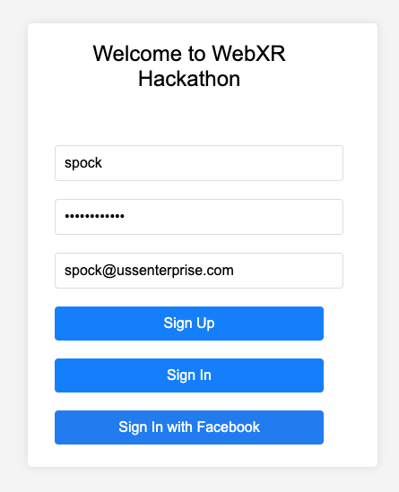

## Setup

Navigate to the `infra/` folder from the project root, and delete the cloud assembly output folder

```
rm -rf cdk.out
```

Go to the `web` folder, and run

```
npm install
npm run build
```

Go to the `infra` folder, and run
```
npm install
cdk bootstrap aws://<YOUR_ACCOUNT_ID>/<YOUR_REGION>
cdk deploy --require-approval never
```

Go to the `web/src` folder, open `amplifyconfigure.js`, and replace the parameters with values from your CDK output. Also, update the region if you are using us-west-2.

```javascript
Auth: {
    // REQUIRED - Amazon Cognito Identity Pool ID
    identityPoolId: '<REPLACE_W_YOUR_IDENTITYPOOLID>',
    
    // REQUIRED - Amazon Cognito Region
    region: 'US-EAST-1',
    
    // REQUIRED- Amazon Cognito User Pool ID
    userPoolId: '<REPLACE_W_YOUR_USERPOOLID>',

    userPoolWebClientId: '<REPLACE_W_YOUR_USERPOOLWEBCLIENTID>',

    // OPTIONAL - Enforce user authentication prior to accessing AWS resources or not
    mandatorySignIn: true,
  },
  Api: {
    url: '<REPLACE_W_YOUR_APIRESTURL>'
  }
```

This configuration enables Amplify to interact with the AWS resources that were deployed using the CDK.

### Test the application locally

Navigate to the `web/` folder and run:

```
npm run serve 
```

Open [localhost:8081](https://localhost:8081) in a browser. Notice you're presented with a login prompt.

Enter a username, password, and your email address, and click "Sign Up"



Email verification is disabled, so go ahead and click "Sign In" with your new user account to access the game.